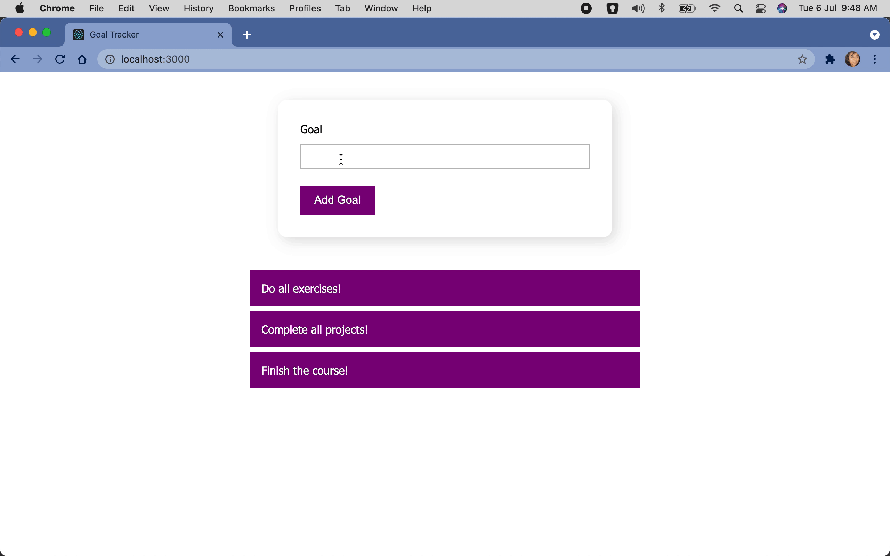

# Goal Tracker

## Table of Contents

1. [Overview](#overview)
2. [Installation](#installation)
3. [Bootstrapping](#bootstrapping)
4. [Credits](#credits)

## Overview

This is a React application that lets a user track their goals. The application allows a user view existing goals, add a new goal to the list of existing goals and delete an existing goal when it's achieved.

Note that providing a goal name is mandatory before adding a goal (white spaces are not allowed) to the list of existing goals. If the user tries to do otherwise, the input box will turn into red color indicating that the user cannot proceed with the value typed inside the input box.

The application is responsive to devices of all screen sizes.

## Installation

1. Clone the [repository](https://github.com/srishti/react-goal-tracker) using Git on your machine. Alternatively, download the `.zip` file of current repository on your machine and then unzip the downloaded zipped file.
2. Go inside the application's directory on your local machine.
3. Install all packages using the following command:\
   `npm i`
4. Run the application using the following command:\
   `npm start`

The application will be run in the development mode.\
Open [http://localhost:3000](http://localhost:3000) to view it in the browser.

The page will reload if you make edits.\
You will also see lint error, if any, in the console.

## Bootstrapping

This application was bootstrapped with [Create React App](https://github.com/facebook/create-react-app).

## Credits

This project is my own version of code while learning React from the course [React - The Complete Guide](https://www.udemy.com/course/react-the-complete-guide-incl-redux/) by _Maximilian Schwarzmüller_ on Udemy.  
Thank you, Maximilian!
